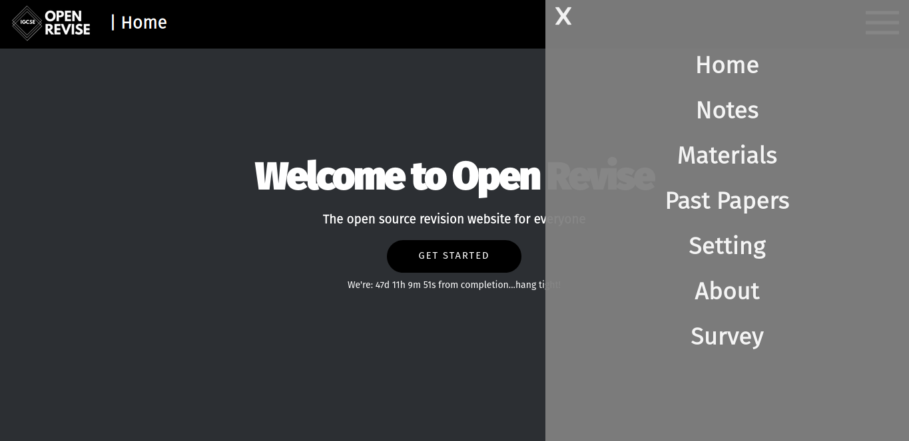
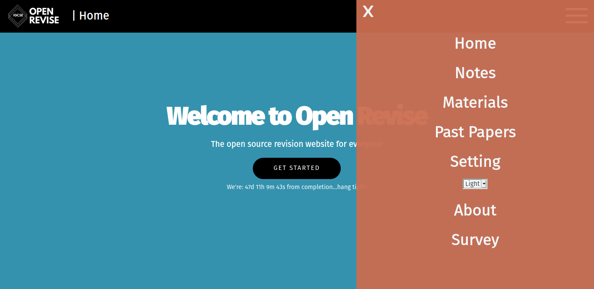
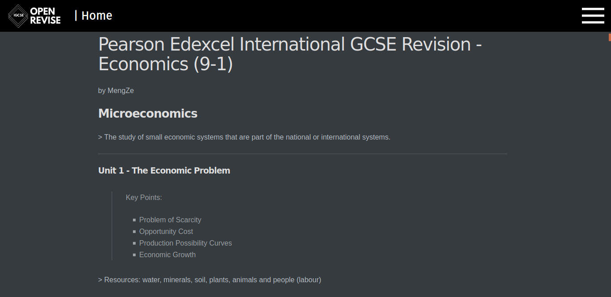

# Open Revise 

>  This is Open Revise, an open source revision website for all IGCSE students.
>
> A student-friendly place for sharing and gaining knowledge with less distraction and relaxing atmosphere.
>
> Revise efficiently with:
>
> * Class Notes
> * Materials (video tutorials etc.)
> * Past Papers

# Development

### Features:

* Note Viewer (markdown)
* Hamburger Menu
* Theme selector (dark & light, more themes are coming!)
* Concentration Mood with music player and timer (beta)

### Offline use (only for desktop users):

1. Use the following link to open the Github repository.

   https://github.com/OpenRevise/OpenRevise.github.io

2. Click `Clone or download`.

3. Click `Download ZIP`.

4. Decompress the zip folder and the website is stored as `index.html`.

   **Warning: there is no update for your local webpage if you downloaded it.** 

   **To update, repeat the same process again (recommended: monthly basis).**

# Screen-shoots

**Dark Theme**

**Light Theme**

**Note Viewer**